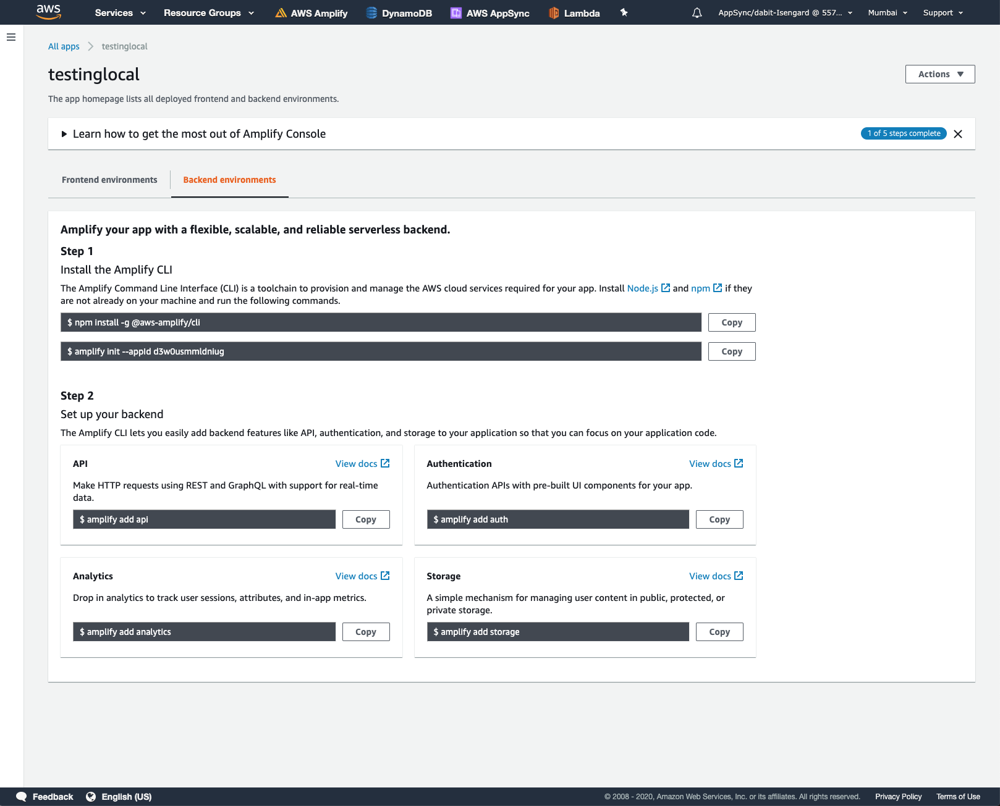
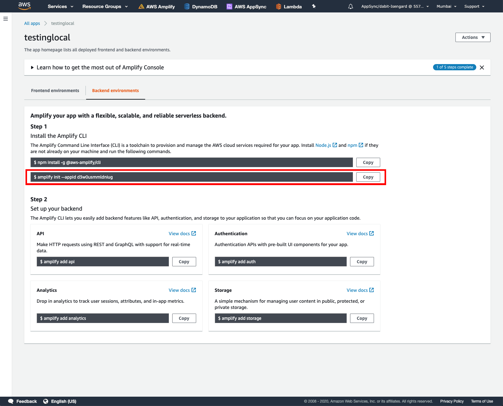

# Learning path (Frontend developer)

### What is a Frontend developer?
A front-end developer codes the visual design and interface of a website. They convert ideas and designs into HTML, JavaScript (JS) and/or CSS - the core elements of front-end development. This includes layout, content, buttons, images, navigation, and links.

### What will I learn

#### Hosting
- Set up and host your website on a Global CDN
#### Authentication
- Add authentication to your website
#### Data and storage
- Add an API, database, and image storage to your website

- Get started

# Build a ReactJS Todo app 
Deploy and host a React app and add interactivity with a GraphQL API, Authentication, and database.

## Overview
- Attributes for the *Tutorial Summary Card* (AWS experience level, time to complete, $ to complete, prerequisites)
- What you will learn
- Application Architecture
- Modules

# Module 1: Deploy and host a React app

AWS Amplify Console provides a Git-based CI/CD workflow for developing, deploying, and hosting single page web applications or static sites with serverless backends. Upon connecting to a Git repository, Amplify determines the build settings for both the frontend framework and any serverless backend resources configured with the Amplify CLI, and automatically deploys updates with every code commit.

In this tutorial, we’ll begin by creating a new React application and pushing it to a GitHub repository.  Then, we will connect the repo to the Amplify Console and deploy it to a globally available content delivery network (CDN) hosted on an amplifyapp.com domain. Next, we’ll demonstrate continuous deployment capabilities by making changes to the React application and pushing a new version to the master branch which will automatically kick off a new deployment.

Everything done in this tutorial is free tier eligible.

## 1. Sign up for AWS

You need an AWS account to following this tutorial on the AWS Amplify Console. There is no additional charge for using AWS Amplify with this tutorial. The resources you create in this tutorial are Free Tier eligible. 

[Sign up for AWS](https://portal.aws.amazon.com/billing/signup/iam?#/start)

## 2. Confirm environmental setup

Open your command line interface and enter the following command:

```sh
node -v;
```

If this command returns less than v8.0, upgrade node to a version greater than version 8. if the command not found, install the node from [nodejs.org/download](nodejs.org/download).

## 3. Create a new React application

The easiest way to create a React application is by using the command create-react-app. Install this package using the following command:

```sh
npx create-react-app amplifyapp
cd amplifyapp
npm start
```

## 4. Initialize GitHub repository

In this step, you will create a GitHub repository and commit your code to the repository. You will need a GitHub account to complete this step – if you do not have an account, sign up [here](here).

a. Create a new GitHub repo for your app ([link](https://github.com/new)).


b. Initialize git and push the application to the new GitHub repo executing the following commands in your command line interface:

```sh
git init
git remote add origin git@github.com:username/reponame.git
git add .
git commit -m ‘initial commit’
git push origin master
```

## 5. Log in to the AWS Amplify Console

Open the [AWS Management Console](AWS Management Console) in a new browser window, so you can keep this step-by-step guide open. When the screen loads, enter your user name and password to get started. Then type Amplify in the search bar and select AWS Amplify to open the service console.


## 6. Deploy your app to AWS Amplify

In this step, you will connect the GitHub repository you just created to the AWS Amplify service. This will enable you to build, deploy, and host your app on AWS.

a. Select Get Started under Deploy.


b. Select GitHub as the repository service and select Next.


c. Authenticate with GitHub and return to the Amplify Console. Choose the repository you created earlier and the master branch, then select Next.


d. Accept the default build settings and select Next.


e. Review the final details and select Save and Deploy.


f. AWS Amplify Console will now build your source code and deploy your app at https://<branchname>.<appid>.amplifyapp.com


g. Once the build completes, select the thumbnail to see your web app up and running live.


## 7. Automatically deploy code changes

In this step, you will make some changes to the code and push the changes to the master branch of your app.

a. Edit *src/App.js*

```sh
import React from 'react';
import logo from './logo.svg';
import './App.css';

function App() {
  return (
    <div className="App">
      <header className="App-header">
        
        <h1>Hello from V2</h1>
      </header>
    </div>
  );
}

export default App;
```

b. Push the changes to GitGub to automatically kick off a new build:

```sh
git add .
git commit -m 'changes for v2'
git push origin master
```

c. Once the build is complete, select the thumbnail on the AWS Amplify console to view your updated app.


## Congratulations
You have deployed a React application in the cloud by integrating with GitHub and using the Amplify Console.

With AWS Amplify Console, you can continuously deploy your application in the cloud and host it on a globally available CDN.

# Module 2: Initialize a local Amplify app

Now that we have initialize a new Amplify project in our account, we want to bring it down into our local environment so we can continue development and add new features. To do so, we'll install the Amplify CLI and initilize the Amplify project using the CLI.

## 1. Install the Amplify CLI

The Amplify Command Line Interface (CLI) is a unified toolchain to create AWS cloud services for your app. Let’s go ahead and install the Amplify CLI.

```sh
npm install -g @aws-amplify/cli
```

## 2. Configure the Amplify CLI

Amazon IAM (Identity and Access Management) enables you to manage users and user permissions in AWS. The CLI uses IAM to create and manage services programmatically on your behalf via the CLI.

To configure the CLI, run the `configure command`.

> To see a video walkthrough of the CLI configureation process, click [here](https://www.youtube.com/watch?v=fWbM5DLh25U).

```sh
amplify configure
```
## Initialize the Amplify app

Next, we will initialize an app locally. Since we have already created an Amplify, we can use this app configuration that has already been created.

a. In the Amplify console, click on *Backend environments*.



b. In the *Backend environments* tab, copy the `amplify init` command to your keyboard



c. Initialize the Amplify project locally

```sh
amplify init --appId your-app-id

? Enter a name for the project: amplifyapp
? Enter a name for the environment: dev
? Choose your default editor: Visual Studio Code
? Choose the type of app that youre building: javascript
? What javascript framework are you using: react
? Source Directory Path: src
? Distribution Directory Path: build
? Build Command:  npm run-script build
? Start Command: npm run-script start
? Do you want to use an AWS profile? Y
? Please choose the profile you want to use: your-aws-profile
```

> Be sure that the profile you are choosing has been configured using the same region as the Amplify project you already deployed.

## Congratulations

You have initialzed the Amplify project and are now ready to start adding features!

To view your Amplify project in the dashboard at any time you can now run the following command:

```sh
amplify console
```

# Module 3: Add authentication

The next feature you will be adding is authentication. In this section, you will learn how to authenticate a user using Amazon Cognito, a managed user identity service.

You will also learn how to use the AWS Amplify UI component library to scaffold out an entire user authentication flow, allowing users to sign up, sign in, and reset their password, with with just few lines of code.

Let's get started.

## 1, Install the Amplify libraries

We will be needing 2 amplify libraries for our project. The main `aws-amplify` library contains all of the client-side APIs for interacting with the various AWS services we will be working with, and the `@aws-amplify/ui-react` library contains framework-specific UI components.

```sh
npm install aws-amplify aws-amplify-react
```

## 2. Create the authentication service

To create the authentication service, use the Amplify CLI

```sh
amplify add auth

? Do you want to use the default authentication and security configuration? Default configuration
? How do you want users to be able to sign in? Username
? Do you want to configure advanced settings? No, I am done.
```

## 3. Deploy the authentication service

Now that the authentication service has been configured locally, we can deploy it by running the Amplify `push` command.

```sh
amplify push --y
```

## 4. Congigure the React project with Amplify resources

The CLI has created and will continue to update a file called *aws-exports.js* located in the *src* directory of our project. We need to use this file to let the React project know about the different resources that are available. To configure our app with these resources, open *src/index.js* and add the following code below the last import:

```js
import Amplify from 'aws-amplify';
import config from './aws-exports';
Amplify.configure(config);
```

## 5. Add the authentication flow in App.js

Next, open *src.App.js* and update with the following code.

```js
import React from 'react';
import logo from './logo.svg';
import './App.css';
import { withAuthenticator, AmplifySignOut } from '@aws-amplify/ui-react'

function App() {
  return (
    <div className="App">
      <header className="App-header">
        
        <h1>Hello from V2</h1>
      </header>
      <AmplifySignOut />
    </div>
  );
}

export default withAuthenticator(App);
```

## 6. Run the app locally

Next, run the app to see the new Authentication flow protecting the app:

```js
npm start
```

Here, you can try signing up which will automatically then sign you in. When signed in, you should be see a sign out button that will sign the user out and restart the authentication flow.

## 7. Deploy the changes to the production environment

Deply the changes to GitHub to kick off a new build in the Amplify console

```sh
git add .
git commit -m 'added auth'
git push origin master
```

## Congratulations

You have now added user authentication to your app!

# Module 4: Add a GraphQL API and database

Now that we've created and configured a the app with Authentication, let's add an API.

The API you will be creating in this step is a GraphQL API using AWS AppSync (a managed GraphQL service) and the database will be Amazon DynamoDB (a NoSQL database).

## 1. Create a GraphQL API and database

Add a GraphQL API to your app and automatically provision a database by running the the following command from the root of your application directory:

```sh
amplify add api
```

# Module 5: Capture user analytics
